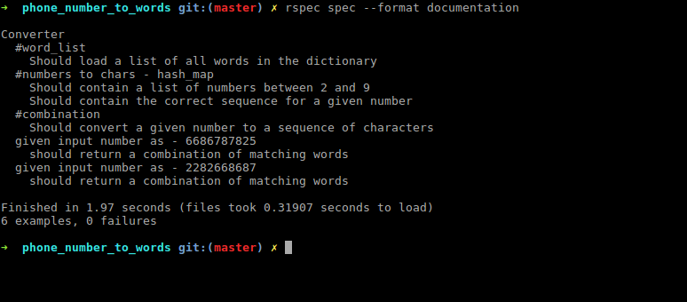

# Phone number to word converter.
  
  - Given a 10digit phone number (which does not contain 0 and 1) the program converts it to a meaning full word from a given dictionary.

# Installation steps.

  - Clone this repo.
  - cd to project folder.
  - install ruby 2.3.0 (if rvm is installed it should prompt you to do so automatically.)
  - bundle install (To get all dependencies)

# Execution Steps.

  - `ruby converter.rb`
  - `rspec spec --format documentation`

# Program output.

  - 
  - 
  
# Test case output.

  - 
